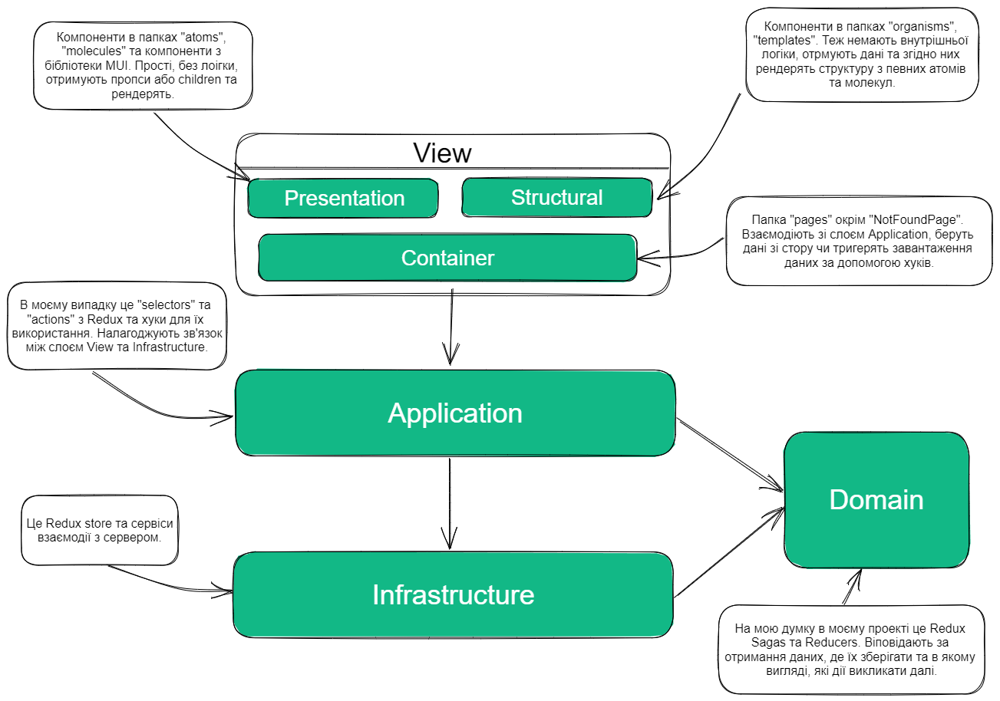

# Опис структури застосунку.

## Опис слоїв(layers) з лекції:

### View:

- Presentation - незалежні від контексту, приймають дані і кидають івенти
- Structural - відповідають за структуру
- Container - комунікують з Application

### Application - хуки, комунікація з Infrastructure та Domain
### Infrastructure - state management, http...
### Domain - чиста бізнес логіка
